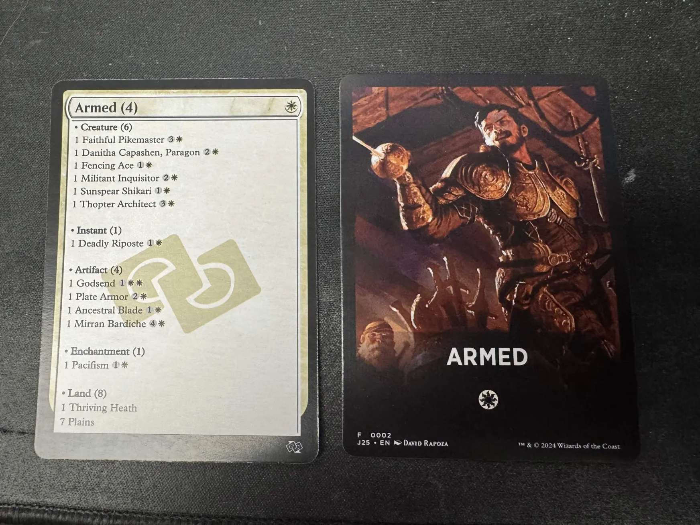

# MTG Jumpstart Card Generator

Create your own physical MTG Jumpstart packs for printing! This project generates ready-to-print card files from official Wizards of the Coast Jumpstart pack lists.

## What is This?

Magic: The Gathering Jumpstart is a fun, quick-play format where you shuffle two themed packs together and start playing immediately. This project takes official WOTC Jumpstart pack lists and creates printable cards that you can order from printing services like makeplayingcards.com.

## What You Get



For each Jumpstart pack, this project creates:

- **Face Cards**: Custom cards showing the pack theme with a complete list of all cards included
- **Back Cards**: Beautiful MTG-themed artwork for the reverse side
- **Print-Ready Files**: Properly sized and formatted for professional printing services

The generated cards include all 8 official Jumpstart sets:
- **Jumpstart 2022** (J22) - 121 packs
- **Jumpstart: Historic Horizons** (J21) - 46 packs  
- **The Lord of the Rings** (LTR) - 40 packs
- **March of the Machine** (MOM) - 40 packs
- **Phyrexia: All Will Be One** (ONE) - 40 packs
- **The Brothers' War** (BRO) - 40 packs
- **Dominaria United** (DMU) - 40 packs
- **The Lost Caverns of Ixalan** (TLA) - 40 packs

## Quick Start - Download Pre-Made Files

**Just want to print cards?** Download the latest files from the [GitHub Releases page](https://github.com/mandreko/jumpstart-generator/releases/latest).

Each release includes:
- **Front Images**: Face cards with pack contents (`*-front-*.jpg`)
- **Back Images**: Themed artwork for card backs (`*-back-*.jpg`)
- **Card Conjurer Files**: Import these into [CardConjurer.app](https://cardconjurer.app/) for customization (`.cardconjurer`)

Total download size: ~250MB (high-quality print files)

## How to Print Your Cards

1. **Download** the latest release files
2. **Upload** the front and back images to your preferred printing service:
   - [makeplayingcards.com](https://makeplayingcards.com) (recommended)
   - [notmpc.com](https://notmpc.com)
   - Any service that accepts custom playing cards
3. **Order** standard poker-sized cards (2.5" × 3.5")
4. **Play!** Each pack contains 20 cards - shuffle two packs together for a complete Jumpstart game

### Print Settings
- **Card Size**: Poker/Standard (2.5" × 3.5")
- **Quality**: 300+ DPI recommended
- **Finish**: Smooth or linen finish work well
- **Quantity**: Order as many sets as you want!

## Customize Your Cards

Want to modify the cards or create your own themes?

1. Download the `.cardconjurer` files from the releases
2. Import them into [CardConjurer.app](https://cardconjurer.app/)
3. Customize artwork, colors, or card lists
4. Export your modified cards

## Generate Files Yourself

Want to run the generator locally? See [TECHNICAL.md](TECHNICAL.md) for detailed setup and usage instructions.

### Quick Local Setup

If you have Node.js installed:

```bash
git clone https://github.com/mandreko/jumpstart-generator.git
cd jumpstart-generator
npm install
npm run rebuild
```

This generates all files locally (~30-40 minutes total processing time).

## File Organization

Generated files follow this naming pattern:
- `{SET}-front-{NUMBER}-{PACK-NAME}.jpg` - Face cards with pack contents
- `{SET}-back-{NUMBER}-{PACK-NAME}.jpg` - Themed artwork backs  
- `{SET}-saved-cards.cardconjurer` - Bulk import files for Card Conjurer

Example: `J22-front-0001-Blink-1.jpg` and `J22-back-0001-Blink-1.jpg`

## Credits

- **Concept**: Inspired by [u/HyperHowie](https://www.reddit.com/user/HyperHowie/) on Reddit
- **Card Data**: [Scryfall](https://scryfall.com/) API
- **Artwork**: [MTG Vectors](https://github.com/pappnu/mtg-vectors) project
- **Card Creation**: [CardConjurer.app](https://cardconjurer.app/)
- **Official Pack Lists**: Wizards of the Coast
- **Development**: 100% coded by Claude AI

## Support

Having issues? Check [TECHNICAL.md](TECHNICAL.md) for troubleshooting or open an issue on GitHub.

---

*This project is not affiliated with Wizards of the Coast. Magic: The Gathering is a trademark of Wizards of the Coast LLC.*